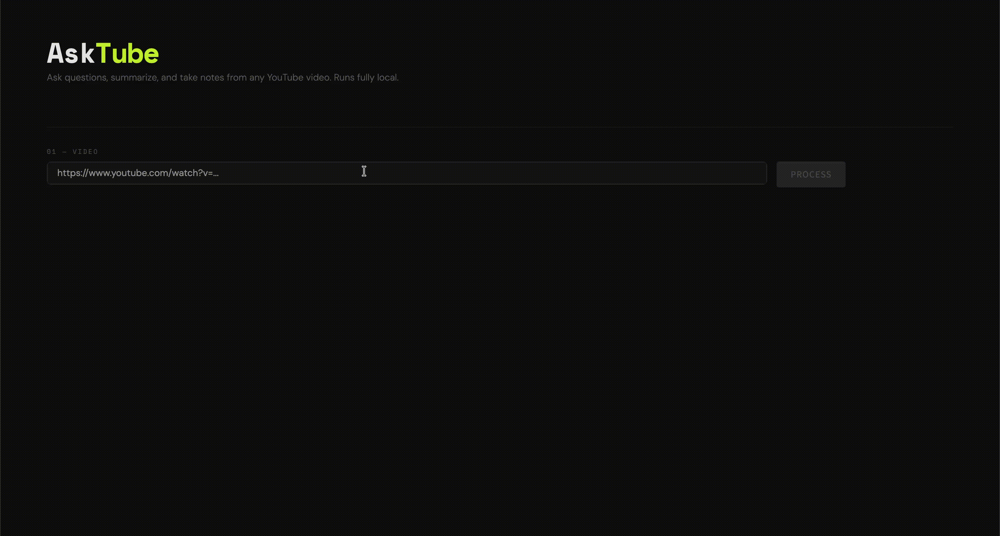
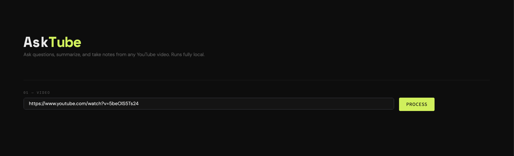
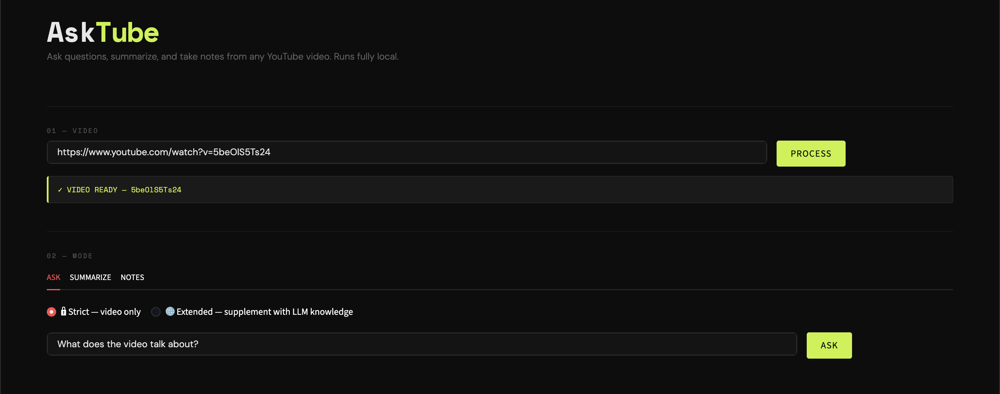
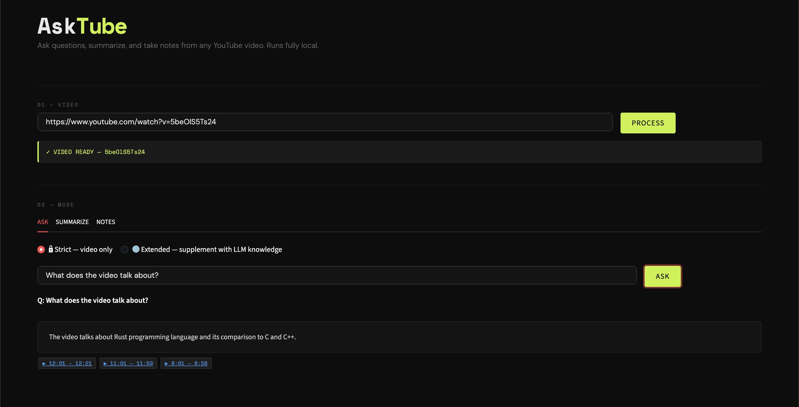

# AskTube 🎬

Ask questions, summarize, and take notes from any YouTube video. Runs fully local — no data sent to external APIs.

---

## Screenshot

> 📸 **[ADD SCREENSHOT HERE: Full app UI — paste a screenshot of the Streamlit interface with a video loaded and a question answered]**

---

## What it does

- Fetches transcripts from any YouTube video
- Chunks transcripts into 60-second windows with timestamp links
- Embeds chunks locally using `BAAI/bge-small-en`
- Stores embeddings in a local ChromaDB vector database
- Answers questions grounded in video content (strict or extended mode)
- Summarizes entire videos
- Takes structured notes by topic

---

## Demo



---

## Tech Stack

| Component | Tool |
|---|---|
| Transcript fetching | `youtube-transcript-api` |
| Embeddings | `sentence-transformers` (BAAI/bge-small-en) |
| Vector DB | ChromaDB (local) |
| LLM | Ollama (Llama 3.2, local) |
| UI | Streamlit |
| Language | Python 3.13 |

---

## Installation

### 1. Clone the repo
```bash
git clone https://github.com/yourusername/AskTube.git
cd AskTube
```

### 2. Create and activate virtual environment
```bash
python3 -m venv venv
source venv/bin/activate
```

### 3. Install dependencies
```bash
python -m pip install -r requirements.txt
```

### 4. Install Ollama and pull the model
Download Ollama from https://ollama.com then run:
```bash
ollama pull llama3.2
```

### 5. Set up environment variables
Create a `.env` file in the project root:
```
OLLAMA_MODEL=llama3.2
CHUNK_SIZE=60
CHROMA_PATH=./chroma_db
```

---

## Usage

```bash
streamlit run app.py
```



You will be prompted to:
1. Paste a YouTube URL and hit **Process**
2. Choose a tab — Ask, Summarize, or Notes
3. For Q&A, choose between strict or extended mode



**Strict mode** — answers only from video content. If the answer isn't in the video it will say so.

**Extended mode** — uses video as primary source but supplements with the LLM's own knowledge. Indicates when going beyond video content.



---

## Project Structure

```
AskTube/
├── app.py                   ← Streamlit UI
├── main.py                  ← Terminal entry point
├── transcript_fetcher.py    ← Fetches transcript from YouTube
├── chunker.py               ← Splits transcript into 60s chunks
├── embedder.py              ← Embeds chunks and stores in ChromaDB
├── query.py                 ← Semantic search over stored chunks
├── rag.py                   ← LLM Q&A with strict/extended mode
├── summarizer.py            ← Video summarization
├── note_taking.py           ← Structured note taking
├── .env                     ← Config (model name, paths etc.)
├── .gitignore               ← Excludes venv, .env, data/
├── requirements.txt         ← Project dependencies
├── data/                    ← Generated JSON files (gitignored)
└── chroma_db/               ← Local vector store (gitignored)
```

---

## How Each File Works

**`transcript_fetcher.py`**
Takes a YouTube URL, extracts the video ID, fetches the transcript using `youtube-transcript-api`, and saves it as a JSON file in `data/`. Each entry contains the spoken text and its timestamp.

**`chunker.py`**
Reads the transcript JSON and groups snippets into 60-second time windows. Each chunk stores the combined text, start/end time, and a direct timestamp link back to that moment in the video.

**`embedder.py`**
Loads the chunks JSON, converts each chunk's text into a 384-dimensional vector using the `bge-small-en` model, and stores it in ChromaDB along with metadata like `video_id` and `timestamp_link`.

**`query.py`**
Takes a question, embeds it using the same model, and searches ChromaDB for the top 3 most semantically similar chunks. Returns the matching text and metadata.

**`rag.py`**
Takes the retrieved chunks and constructs a prompt for the LLM. In strict mode the LLM is constrained to answer only from the video content. In extended mode it can supplement with its own knowledge.

**`summarizer.py`**
Loads all chunks from a video and sends them to the LLM with a summarization prompt. Produces a concise structured summary covering main topics.

**`note_taking.py`**
Same as summarizer but with a note-taking prompt. Produces structured bullet points organized by topic — easy to reference later.

---

## Future Roadmap

- **Multiple video support** — query across several videos at once, useful for comparing topics across different sources
- **Topic/folder mapping** — auto-generate a topic index across all ingested videos so you can browse what each video covers without watching it
- **Whisper fallback** — for videos without captions, use OpenAI Whisper locally to generate transcripts
- **Podcast support** — extend ingestion to handle podcast RSS feeds and audio files
- **Export notes** — save generated notes and summaries as markdown or PDF files
- **Chunk size tuning** — make chunk window size configurable per video based on content density
- **Chat history persistence** — save Q&A sessions per video for future reference

---

## Notes

- Everything runs locally — no data is sent to external APIs
- The `data/` folder and `chroma_db/` are gitignored — regenerate them by running the app
- First run downloads the embedding model (~130MB) — subsequent runs use the cached version
- Ollama must be running in the background before starting the app